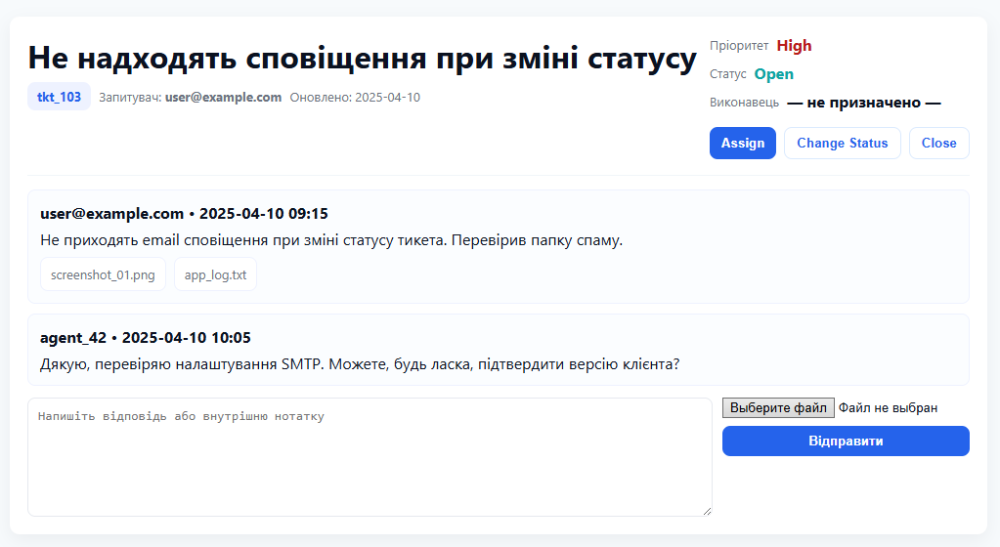

# Інструкція користувача  
Короткий посібник для швидкого старту з HelpDeskPro: реєстрація, створення тикета, відстеження статусу та корисні поради для ефективної роботи.

## Початок роботи
**Реєстрація**  
1. Відкрийте головну сторінку HelpDeskPro.
2. Натисніть **Sign Up** або **Реєстрація**.
3. Введіть **email**, пароль і натисніть **Підтвердити**.
4. Підтвердіть акаунт через лист, якщо увімкнено підтвердження **email**.

**Вхід у систему**
- Натисніть **Sign In** або **Увійти**, введіть email і пароль.
- Після успішного входу ви потрапите на **Dashboard** — огляд активних тикетів і сповіщень.

## Створення звернення  
На панелі натисніть **New Ticket** або **Створити звернення** і заповніть форму:
- **Тема / Заголовок** — короткий заголовок проблеми.
- **Опис** — детальний опис проблеми, кроки відтворення та очікуваний результат.
- **Категорія** — виберіть категорію для правильної маршрутизації.
- **Пріоритет** — низький / середній / високий (low, medium, high).
- **Додати файл** — прикріпіть скріншоти, логи або інші вкладення для прискорення діагностики.  
Натисніть **Відправити**. Після цього ви отримаєте номер тикета і підтвердження на email.

**Приклад інтерфейсу створення звернення**

## Перегляд і управління тикетами
- Мої звернення показує список ваших тикетів з фільтрами за статусом і пріоритетом.
- Відкрийте тикет, щоб переглянути історію коментарів, додати новий коментар або прикріпити файл.
- Щоб оновити статус або закрити тикет, скористайтеся кнопками у верхній частині перегляду тикета.

## Комунікація з підтримкою
- Усі повідомлення між вами і агентом зберігаються в історії тикета.
- Ви отримаєте email‑сповіщення при зміні статусу або новому коментарі.
- Для швидшого вирішення додавайте логи, скріншоти і точні кроки відтворення проблеми.

## Налаштування профілю і сповіщень
- Перейдіть у **Settings** або **Профіль** для редагування імені, email і пароля.
- У розділі **Notifications** налаштуйте, які сповіщення отримувати: email, push або обидва.
- Можна вказати робочі години для коректного розрахунку SLA.  

## Приклади інтерфейсу
- **Dashboard** — огляд відкритих тикетів, швидкі фільтри і статистика.

- **Ticket View** — деталі звернення, історія коментарів, кнопки для відповіді і закриття.

- **Admin Panel** — керування користувачами, категоріями і правилами маршрутизації.

## FAQ
**Як дізнатися номер мого тикета?**  
Номер відображається у підтверджувальному листі, а також у списку **Мої звернення** поруч із заголовком тикета.

**Чи можна додати вкладення після створення тикета?**  
Так. Відкрийте тикет і натисніть **Додати вкладення** або перетягніть файл у поле коментаря.

**Як додати скріншот?**  
При створенні або в перегляді звернення натисніть **Додати файл** і завантажте зображення; можна також перетягнути файл у поле коментаря. 

**Що робити, якщо не приходять email‑сповіщення?**  
Перевірте папку «Спам», налаштування сповіщень у профілі і правильність email у вашому акаунті; за потреби зверніться до адміністратора системи.  

**Як змінити пріоритет звернення?**  
Відкрийте звернення і в полі Пріоритет виберіть потрібний рівень (низький, середній, високий). Якщо ви не бачите цього поля, зверніться до підтримки або до адміністратора.  

**Чи можна призначити звернення іншому співробітнику?**  
Так — якщо у вас є права агента або адміністратора, у полі **Виконавець** виберіть потрібного користувача. Звичайні користувачі можуть попросити зміну через коментар у тикеті. 

**Як змінити виконавця або пріоритет, якщо я звичайний користувач?**  
Додайте коментар у тикеті з проханням змінити пріоритет або призначити іншого виконавця — агент або адміністратор виконає запит. 

> **Порада**: вводьте короткі, але інформативні описи з кроками відтворення і додавайте скріншоти або логи — це значно пришвидшить діагностику і вирішення.

## Короткий чекліст для першого використання  
- [ ] Зареєструватися і підтвердити email.
- [ ] Увійти і перевірити Dashboard.
- [ ] Створити тестовий тикет з описом і вкладенням.
- [ ] Перевірити отримання email‑підтвердження.
- [ ] Налаштувати сповіщення у профілі.
